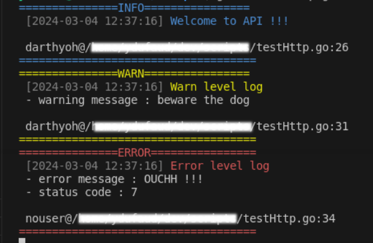

# custom-slog-logger
Custom logger based on slog used to display nice colored messages including source lines of error and, if provided in context, "userid" value

## Installation

A simple `go get github.com/darthyoh/custom-slog-logger` should install the package in your module.

## Usage

**custom-slog-logger** is a custom logger based on the **slog** package

The following example shows how to use the logger

```
package main

import (
	"context"
	"fmt"
	"log"
	"log/slog"
	"net/http"
	"os"

	customsloglogger "github.com/darthyoh/custom-slog-logger"
)

func main() {
	mux := http.NewServeMux()

	logger := customsloglogger.NewCustomLogger(os.Stderr, "userid")

	mux.HandleFunc("GET /", func(w http.ResponseWriter, r *http.Request) {

		//the userid is defined in the "userid" key of context
		//WARNING : you SHOULD NOT USE DIRECTY A BUILD IN TYPE LIKE THIS :
		ctx := context.WithValue(r.Context(), "userid", "darthyoh")

		//Info log : Simple Log, passing context without any attributes
		logger.LogAttrs(ctx, slog.LevelInfo, "Welcome to API !!!")

		//Instead, use the provided ContextUser type
		ctx2 := context.WithValue(r.Context(), customsloglogger.ContextUser("userid"), "darthyoh")
		//Warn log : Warn Log, passing context with some attrs
		logger.LogAttrs(ctx2, slog.LevelWarn, "Warn level log", slog.String("warning message", "beware the dog"))

		//Error log : error level log, no context passed with attrs
		logger.LogAttrs(context.TODO(), slog.LevelError, "Error level log",
			slog.String("error message", "OUCHH !!!"),
			slog.Int("status code", 7),
		)

		fmt.Fprint(w, "Welcome to API !!!\n")
	})

	if err := http.ListenAndServe("localhost:8080", mux); err != nil {
		log.Fatalf("unable to listen")
	}
}

```

A call to `curl http://localhost:8080` whould produce this log :




